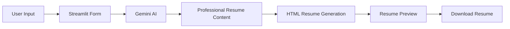

#                               🧠 AI Resume Builder

  

  
  
  
  

  

---

## 🚀 Features

✨ AI-Powered Resume Generation
✨ Professional Content Enhancement
✨ Multiple Resume Themes
✨ Dynamic HTML Resume Preview
✨ One-Click Resume Download
✨ Streamlit-Based Interactive UI
✨ Google Gemini AI Integration

---

## 🎥 Project Demo

  

---

## 🛠️ Tech Stack

| Technology       | Usage                     |
| ---------------- | ------------------------- |
| Python           | Backend Logic             |
| Streamlit        | User Interface            |
| Google Gemini AI | Resume Content Generation |
| HTML/CSS         | Resume Design             |
| JSON             | Data Processing           |

---

## 📊 Project Workflow

---

## 🌟 Future Enhancements

* ATS Resume Score Analyzer
* PDF Export
* Cover Letter Generator
* Portfolio Website Builder
* LinkedIn Integration

---

### 👨‍💻 Developed By

**Sarang Jaiswal**
