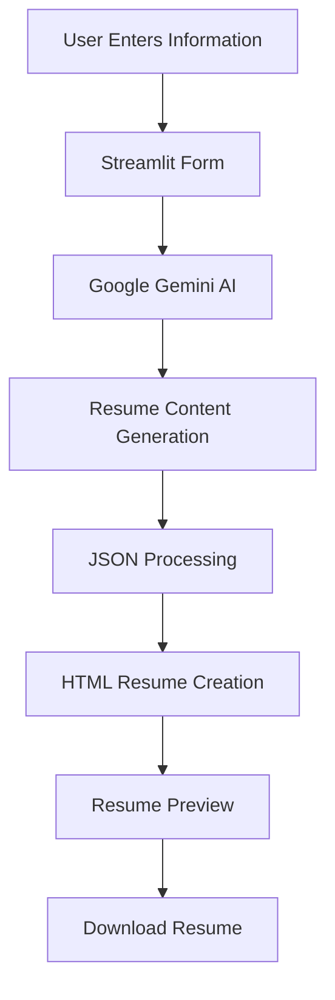

# 🧠 AI Resume Builder

<p align="center">
  
</p>

<p align="center">
  
  
  
  
</p>

---

## 📸 Application Preview

<p align="center">
  
</p>

---

## 🚀 Overview

AI Resume Builder is an intelligent web application that helps users create professional resumes instantly using **Google Gemini AI**.

The application takes user information such as education, skills, projects, certifications, and achievements, then transforms it into a polished and industry-ready resume.

---

## ✨ Features

* 🤖 AI-Powered Resume Generation
* 📝 Professional Resume Content Enhancement
* 🎨 Multiple Resume Templates
* ⚡ Instant Resume Creation
* 👀 Live Resume Preview
* 📥 Download Resume as HTML
* 📋 Structured Resume Sections
* 🌐 Streamlit Web Interface
* 🔥 Gemini AI Integration

---

## 🛠️ Tech Stack

| Technology       | Purpose                   |
| ---------------- | ------------------------- |
| Python           | Backend Development       |
| Streamlit        | Web Interface             |
| Google Gemini AI | Resume Content Generation |
| JSON             | Data Formatting           |
| HTML & CSS       | Resume Design             |

---

## 📂 Project Structure

```text
AI-Resume-Builder/
│
├── app.py
├── README.md
├── requirements.txt
├── Screenshot 2026-05-02 003638.png
│
└── Generated Resumes
```

---

## ⚙️ Working Process



---

## 📋 Supported Resume Sections

### Personal Information

* Full Name
* Contact Details

### Education

* Degree
* College/University
* Academic Details

### Skills

* Technical Skills
* Soft Skills

### Projects

* Academic Projects
* Personal Projects

### Certifications

* Online Certifications
* Internship Certifications

### Awards

* Achievements
* Recognition

### Languages

* Spoken Languages

---

## 🎨 Available Resume Themes

| Theme          | Color  |
| -------------- | ------ |
| Classic Blue   | Blue   |
| Strange Orange | Orange |
| Funky Yellow   | Yellow |
| Corporate Grey | Grey   |

---

## 📦 Installation

### Clone Repository

```bash
git clone https://github.com/yourusername/AI-Resume-Builder.git
cd AI-Resume-Builder
```

### Install Required Packages

```bash
pip install streamlit
pip install google-generativeai
```

Or

```bash
pip install -r requirements.txt
```

### Add Gemini API Key

Replace:

```python
genai.configure(api_key="ENTER YOUR_API_KEY")
```

with your actual Gemini API Key.

---

## ▶️ Run Application

```bash
streamlit run app.py
```

---

## 🎯 Learning Outcomes

This project helped in learning:

* Generative AI Applications
* Prompt Engineering
* Streamlit Development
* API Integration
* JSON Handling
* HTML Resume Design
* User Interface Design
* Python Project Development

---

## 🔮 Future Improvements

* ATS Resume Scoring
* PDF Download Support
* Cover Letter Generator
* Portfolio Website Generator
* Resume Template Gallery
* LinkedIn Integration
* Dark Mode Support

---

## 👨‍💻 Developer

### Sarang Jaiswal

BCA (AI & Data Analytics)

LNCT University

---

## ⭐ Support

If you found this project useful, consider giving it a ⭐ on GitHub.

It motivates future development and improvements.

---

<p align="center">
  Made with ❤️ using Python, Streamlit and Google Gemini AI
</p>
